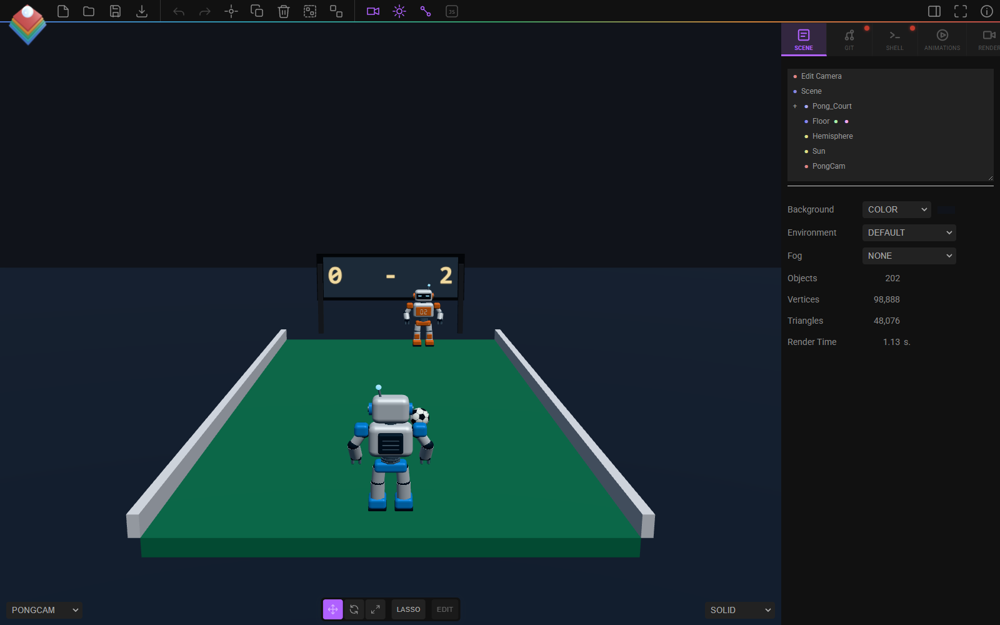

# Robot Soccer Pong

[Open the editable scene in Strata](https://tejaswigowda.com/strata-editor/#repo=jordan77-lang/strata2&file=pong/pong.json).

The ball is a classic soccer ball with 12 black pentagons and 20 white hexagons. The player is a blue robot; the computer is an orange robot.

- `pong.json`: self-contained Strata project, including the scoreboard image. Open it with **File > Open** in Strata.
- `pong.glb`: matching portable 3D scene for use with the existing `pong.js` controller.
- `pong.js`: original game controller. Movement, scoring, collisions, reset, sound, and camera behavior are unchanged.
- `pong-preview.png`: preview captured in the Strata editor with Playwright.

The original `Ball`, `Player_Paddle`, and `Computer_Paddle` objects retain their names, UUIDs, transforms, and collision geometry. Their old surfaces are hidden; the replacement models are children of those same objects. The camera, court, scoreboard, and spawn marker are preserved. The ball keeps its original 0.35-unit radius.

Validated in Playwright: scene loading, GLB loading, player movement, robot collision bounce, scoring, reset, and 600 simulated game frames.

